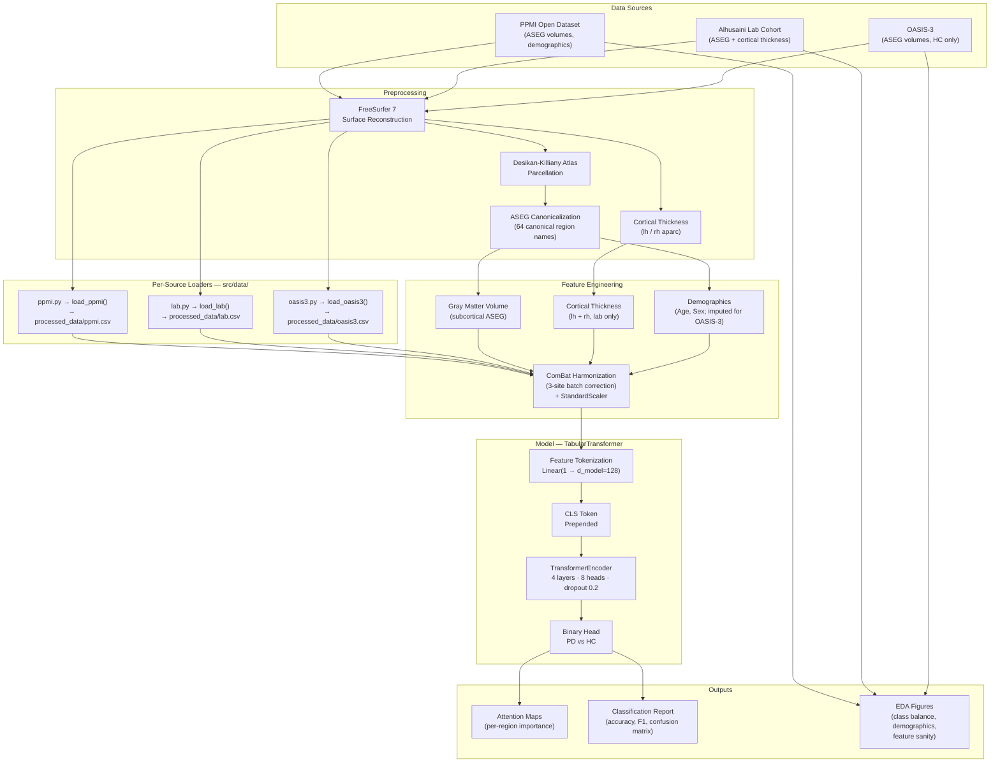
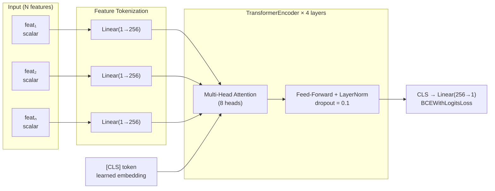
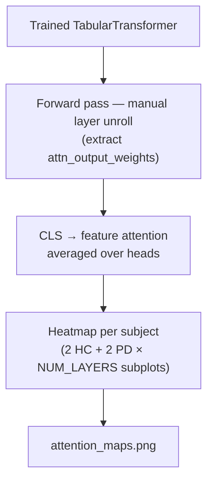

# Detecting Regional Brain Atrophy as a Biomarker for Parkinson's Disease

> NEUR 680 Final Project — Brown University

---

## Abstract

**Background:** Parkinson's disease (PD) is a progressive neurodegenerative disorder marked by dopaminergic neuron loss, primarily in the substantia nigra. Current staging relies on subjective motor assessments (e.g., the Hoehn & Yahr scale), which are insensitive to early structural neurodegeneration. Structural T1-weighted MRI offers a non-invasive method for identifying regional gray matter atrophy, yet it remains unclear which brain regions degenerate earliest, which track disease severity most closely, and whether structural features alone can objectively predict disease stage.

**Scientific Question:** Can regional gray matter volume and cortical thickness, derived from T1-weighted structural MRI, serve as objective biomarkers to distinguish healthy controls from PD patients and to classify disease stage?

**Hypothesis:**
1. Subcortical regions — particularly the substantia nigra, basal ganglia, and thalamus — will show the earliest and most diagnostically powerful atrophy.
2. Cortical atrophy will be more widespread in later stages.
3. A multi-region classifier will significantly outperform any single-region model for staging prediction.

**Methods:** T1-weighted structural MRI scans from [Dr. Alhusaini's lab](https://sites.brown.edu/alhusaini/) and the [Parkinson's Progression Markers Initiative (PPMI)](https://www.ppmi-info.org/) open-source dataset are preprocessed using FreeSurfer on HPC infrastructure. Brain parcellation follows the Desikan-Killiany atlas; gray matter volume and cortical thickness features are extracted via FreeSurfer sub-segmentation and FSL. A tabular transformer (token-per-feature, CLS-head) is pretrained on PPMI ASEG volumes and fine-tuned on the lab cohort with cortical thickness features appended. Region-wise attention weights are extracted to rank the diagnostic importance of individual brain structures.

**Expected Outcomes:** A ranked set of brain regions by diagnostic power for PD staging, with subcortical structures as early markers and cortical regions emerging in later stages, visualized via attention maps and published on a publicly accessible project website.

---

## Pipeline Overview



---

## Model Architecture

The core model is a **permutation-equivariant tabular transformer** — each scalar MRI feature is treated as an independent token, making the architecture naturally extensible to different feature sets between pretraining and fine-tuning.



---

## Repository Structure

```
neur680-final-project/
├── train.py                  # Main training entry point
├── main.py                   # Placeholder CLI
├── analyze.ipynb             # EDA notebook (class balance, demographics, ASEG sanity)
├── pyproject.toml            # Project metadata and dependencies
│
├── src/
│   ├── config.py             # Global hyperparameters
│   ├── model.py              # TabularTransformer definition
│   ├── trainer.py            # Training loop and evaluation metrics
│   ├── attention.py          # Attention weight extraction and heatmap plotting
│   └── data/
│       ├── ppmi.py           # PPMI loader → processed_data/ppmi.csv
│       ├── lab.py            # Lab cohort loader → processed_data/lab.csv
│       ├── oasis3.py         # OASIS-3 loader → processed_data/oasis3.csv
│       ├── combined.py       # Merges all three sources + ComBat harmonization
│       ├── loaders.py        # Scaling, balancing, PyTorch DataLoaders
│       └── normalize.py      # 64-region canonical ASEG name alignment
│
├── raw_data/
│   ├── ppmi/
│   │   ├── FS7_ASEG_VOL_<date>.csv        # FreeSurfer 7 ASEG volumes
│   │   ├── FS7_APARC_SA_<date>.csv        # aparc surface area (auxiliary)
│   │   ├── Demographics_<date>.csv        # PPMI demographics (auxiliary)
│   │   └── PPMI_Curated_Data_Cut*.xlsx    # ⚠ Required: labels + age/sex (not in repo)
│   ├── lab/
│   │   ├── aseg_volumes.txt               # In-house ASEG export (TSV)
│   │   ├── demographic_clean.txt          # Age, sex, group labels (TSV)
│   │   ├── lh_thickness.txt               # Left hemisphere cortical thickness (TSV)
│   │   └── rh_thickness.txt               # Right hemisphere cortical thickness (TSV)
│   └── oasis3/
│       ├── healthy_oasis3.csv             # Subject IDs for the HC cohort (~1 681 subjects)
│       ├── aseg_lh_rh_download_oasis_freesurfer.sh  # ⚠ Run first to download stats files
│       └── healthy/<freesurfer_id>/
│           └── aseg.stats                 # FreeSurfer ASEG stats (downloaded by script)
│
├── processed_data/           # Auto-generated on every train.py run
│   ├── ppmi.csv              # Processed PPMI subjects
│   ├── lab.csv               # Processed lab subjects
│   ├── oasis3.csv            # Processed OASIS-3 subjects (empty until downloaded)
│   └── patient_data.csv      # Merged wide table (used by attention plotting)
│
└── checkpoints/              # Created at runtime
    └── combined.pt           # Saved after training
```

---

## Data Sources

| Dataset | Access | Contents used | Labels |
|---------|--------|---------------|--------|
| **PPMI** (Parkinson's Progression Markers Initiative) | [ppmi-info.org](https://www.ppmi-info.org/) — registration required | ASEG volumes (`FS7_ASEG_VOL`), curated labels and demographics (`PPMI_Curated_Data_Cut*.xlsx`) | PD + HC |
| **Alhusaini Lab Cohort** | Private — Brown University ([lab site](https://sites.brown.edu/alhusaini/)) | ASEG volumes, bilateral cortical thickness, demographics | PD + HC |
| **OASIS-3** | [oasis-brains.org](https://www.oasis-brains.org/) — registration required | ASEG volumes from FreeSurfer stats files (`healthy_oasis3.csv` subject list) | HC only (CDR = 0 throughout) |

All cohorts are parcellated with the **Desikan-Killiany atlas** via **FreeSurfer**. ASEG region names are harmonized to 64 canonical names defined in `src/data/normalize.py`. Age and Sex are not stored in OASIS-3 aseg.stats files; they are imputed from the PPMI + Lab medians before training.

> **OASIS-3 download:** Before OASIS-3 subjects are included in training, run the download script:
> ```bash
> bash raw_data/oasis3/aseg_lh_rh_download_oasis_freesurfer.sh
> ```
> Until the files are downloaded, `load_oasis3()` returns an empty DataFrame and training proceeds on PPMI + Lab only.

---

## Installation

Requires **Python ≥ 3.14**.

```bash
git clone <repo-url>
cd neur680-final-project

python -m venv .venv
source .venv/bin/activate

pip install -e .
```

Key dependencies (see `pyproject.toml`):

| Package | Role |
|---------|------|
| `torch` | Transformer model and training |
| `scikit-learn` | Evaluation metrics, stratified splits |
| `imbalanced-learn` | `RandomUnderSampler` for class balance |
| `pandas` | Data loading and merging |
| `matplotlib` | Figures and attention maps |
| `openpyxl` | Reading PPMI curated Excel file |

---

## Usage

### Exploratory Data Analysis

Open `analyze.ipynb` in Jupyter to inspect class balance, demographic distributions, and cross-dataset ASEG feature sanity checks.

```bash
jupyter notebook analyze.ipynb
```

Saved figures: `class_balance.png`, `demographics.png`, `feature_sanity.png`.

### Training

```bash
python train.py
```

On each run `train.py` will:

1. **Prepare data** — call each source loader, which processes its raw files and writes a fresh CSV to `processed_data/` (`ppmi.csv`, `lab.csv`, `oasis3.csv`).
2. **Merge** — align all three sources on their common canonical ASEG features and apply ComBat harmonization across sites (Age/Sex imputed for OASIS-3 rows).
3. **Train** — fit the TabularTransformer and save the checkpoint to `checkpoints/combined.pt`.
4. **Evaluate** — print a classification report and save attention maps to `attention_maps.png`.

OASIS-3 data is included automatically once the download script has been run; if the stats files are absent the run continues on PPMI + Lab only.

---

## Key Hyperparameters

| Parameter | Value | Location |
|-----------|-------|----------|
| `D_MODEL` | 128 | `src/config.py` |
| `NHEAD` | 8 | `src/config.py` |
| `NUM_LAYERS` | 4 | `src/config.py` |
| `DROPOUT` | 0.2 | `src/config.py` |
| `BATCH_SIZE` | 128 | `src/config.py` |
| `PRETRAIN_EPOCHS` | 1000 | `src/config.py` |
| `FINETUNE_EPOCHS` | 500 | `src/config.py` |
| `LR` | 1e-4 | `src/config.py` |
| `TEST_SIZE` | 0.4 | `src/config.py` |
| `RANDOM_SEED` | 42 | `src/config.py` |
| `PATIENCE` | 1000 | `src/config.py` |
| `USE_COMBAT` | True | `src/config.py` |

---

## Attention-Based Region Ranking

After fine-tuning, `src/attention.py` extracts per-layer, per-head attention weights from the `[CLS]` token to each feature token. The resulting heatmaps (`attention_maps.png`) show which brain regions the model attends to most when classifying HC vs PD subjects, providing an interpretable ranking of diagnostic importance across the 64 ASEG regions and bilateral cortical parcels.



---

## Citation / Acknowledgements

- PPMI data obtained from the [Parkinson's Progression Markers Initiative](https://www.ppmi-info.org/), funded by the Michael J. Fox Foundation.
- Lab MRI data courtesy of [Dr. Saud Alhusaini](https://sites.brown.edu/alhusaini/), Brown University.
- FreeSurfer: Dale et al. (1999), Fischl et al. (1999).
- Desikan-Killiany Atlas: Desikan et al. (2006).
